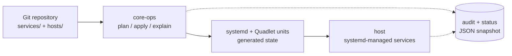

# CoreOps

<p align="center">
  
</p>

<p align="center">
  <strong>GitOps-style service management for systemd hosts</strong>
</p>

<p align="center">
<a href="https://github.com/outergod/core-ops/actions/workflows/ci.yml"></a>
<a href="https://github.com/outergod/core-ops/actions/workflows/e2e-gate.yml"></a>
<a href="https://github.com/outergod/core-ops/releases/latest"></a>
<a href="LICENSE"></a>
</p>

CoreOps takes a Git repository containing [Quadlet] units, systemd drop-ins, and config files,
shows what would change on the host, and can then apply those changes safely.

It is for people who already run services with systemd and Podman/Quadlet, but want:

- `plan`: see exactly what would be created, changed, or removed
- `apply`: make the host match the repository
- `status`: see what Git revision produced the current host state

CoreOps does not replace systemd. It writes the systemd/Quadlet artifacts you would otherwise
manage by hand, then lets systemd run the services.

[Quadlet]: https://www.redhat.com/en/blog/quadlet-podman

<p align="center">
  <a href="https://asciinema.org/a/HaqIw05gehGk2YpH">
    
  </a>
</p>

<p align="center">
  <a href="https://asciinema.org/a/HaqIw05gehGk2YpH">Watch the full terminal session on asciinema</a>
</p>

---

## Why CoreOps exists

Running services directly on a systemd host works well, especially on Fedora CoreOS:
systemd starts services, Podman runs containers, and Quadlet describes containers as units.

The hard part is keeping the host in sync over time.

After a while you have container units, networks, volumes, drop-ins, config files,
host-specific changes, and manual edits. You want to know:

- What should be on this host?
- What is actually on this host?
- What would change if I apply the repository?
- Which Git revision produced the current state?

CoreOps answers those questions and applies the required changes.

---

## Real-world examples

These examples show CoreOps repositories for common self-hosted and small-infra services.
You can run `plan` against each example directly, without initializing CoreOps first.

* [`examples/01-caddy-whoami`](examples/01-caddy-whoami) — Caddy reverse proxy fronting whoami (single-container baseline).
* [`examples/02-nextcloud`](examples/02-nextcloud) — Nextcloud + Postgres + Redis + Traefik (multi-container, intra-service network, persistent storage).
* [`examples/03-immich`](examples/03-immich) — Immich photo server with ML worker (GPU device, multi-network).
* [`examples/04-traefik-authelia`](examples/04-traefik-authelia) — Traefik + Authelia + protected backend (cross-service ForwardAuth composition).
* [`examples/05-observability`](examples/05-observability) — Prometheus + Grafana + node-exporter + cadvisor (host-scope sidecars).

Try one without committing to anything:

```sh
core-ops plan --source-repo examples/01-caddy-whoami --host example
```

---

## Quick start

Download the [latest release] from the GitHub Releases page.

[latest release]: https://github.com/outergod/core-ops/releases/latest

CoreOps is distributed as release bundles for `x86_64` (`amd64`) and `aarch64` (`arm64`).
No external runtime dependencies are required beyond a supported host.

Each bundle includes:

- `core-ops-linux-<arch>`
- `core-ops.service`
- `core-ops.timer`
- `LICENSE`
- `CHANGELOG.md`
- `README.md`

Install the binary and systemd units:

```bash
tar -xzf core-ops-linux-<arch>.tar.gz
install -m 0755 core-ops-linux-<arch> /usr/local/bin/core-ops
install -m 0644 core-ops.service /etc/systemd/system/core-ops.service
install -m 0644 core-ops.timer /etc/systemd/system/core-ops.timer
systemctl daemon-reload
```

Check the installation:

```bash
core-ops --version
core-ops status
```

A valid installation should:

* report a build identity
* expose current system state
* produce stable, inspectable output

To run CoreOps automatically, initialize a repository once and enable the timer:

```bash
# One-time setup: persist repository and tracking ref
core-ops init <repository-url> <ref>

# Enable the timer
systemctl enable --now core-ops.timer
```

To override the quadlet directory or other defaults, use a systemd drop-in:

```bash
systemctl edit core-ops.service
```

### Supported systems

- **Supported:** Fedora CoreOS  
- **Expected to work:** other systemd-based hosts (untested)  
- **Unsupported:** non-systemd environments  

CoreOps must run on the host. Running CoreOps itself inside a container is not supported.

---

## Trust model

CoreOps changes host-level systemd and Quadlet files, so it is intentionally conservative.

You can inspect changes before applying them with `core-ops plan`.
After applying, `core-ops status` records what was applied and which Git revision it came from.
If something is wrong, fix or revert the repository, then run `core-ops apply` again.

---

## Architecture



**Read left-to-right.** A Git repository (`services/` + `hosts/`)
feeds `core-ops` (`plan` / `apply` / `explain`), which generates
systemd + Quadlet units that the host runs under systemd. Audit and
status are JSON side outputs of both `core-ops` and the host.

---

## AI authorship

CoreOps is developed with AI assistance.

AI influences how the system is produced, not how it behaves.

The project relies on:

* the specification
* the test corpus
* the release gate

---

## Target audience · License · Further reading

* Homelab operators working with systemd-based hosts
* Small and medium infrastructure teams
* Operators who prefer inspectable, host-native workflows

CoreOps is licensed under the GNU Affero General Public License v3 or later
(AGPLv3+). See [LICENSE](LICENSE).

* [CHANGELOG.md](CHANGELOG.md)
* [CODE_OF_CONDUCT.md](CODE_OF_CONDUCT.md)
* [docs/development.md](docs/development.md)

Externally visible changes are tracked in [CHANGELOG.md](CHANGELOG.md) using
Keep a Changelog format.
